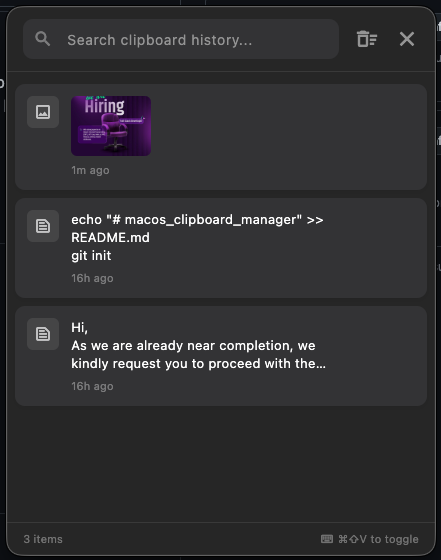

# MacClip - The Modern macOS Clipboard Manager

)

**MacClip** is a lightweight, blazing-fast, and beautiful clipboard manager for macOS, designed to boost your productivity. It runs silently in the background, remembering everything you copy so you never lose a link, text snippet, or image again.

## Features

- **Infinite History**: Automatically saves text and images copied to your clipboard.
- **Global Hotkey**: Press `⌘ + Shift + V` anywhere to open your history instantly.
- **Smart Search**: Find that lost link or snippet in milliseconds.
- **Pin Favorites**: Keep important items at the top of your list.
- **Image Support**: Preview copied images directly in the history.
- **Dark Mode**: Native macOS look and feel, supporting both Light and Dark themes.
- **Persistent**: Runs in the background and launches automatically at login.

## Installation

1. Go to the [Releases](https://github.com/shakibalhasan-code/macos_clipboard_manager/releases) page.
2. Download the latest `MacClipboard.tar.gz`.
3. Extract the archive (double-click it).
4. Drag `Clipboard Manager.app` to your **Applications** folder.
5. **Important**: Since this app is not signed by Apple yet, you may see a warning.
   - **Right-click** (or Control-click) the app and select **Open**.
   - Click **Open** in the dialog box.
   - *Alternatively*: Go to **System Settings > Privacy & Security** and scroll down to click **Open Anyway**.
6. Grant **Accessibility Permissions** when prompted.
   - This is required for the global hotkey (`⌘ + Shift + V`) to work even when the app is in the background.

## Usage settings

1. **Open History**: `Cmd + Shift + V`
2. **Paste Item**: Click any item to copy it back to your clipboard.
3. **Pin Item**: Click the pin icon to save it permanently.
4. **Delete Item**: Click the trash icon to remove it.

## Privacy & Permissions

**MacClip** values your privacy.
- **Offline First**: All clipboard history is stored locally on your machine.
- **No Tracking**: No data is sent to the cloud.
- **Accessibility Permission**: Required solely to detect the global hotkey (`⌘+Shift+V`) even when the app is in the background.

## Contributing

Contributions are welcome! If you have ideas for new features or bug fixes, feel free to open an issue or submit a pull request.

1. Fork the Project
2. Create your Feature Branch (`git checkout -b feature/AmazingFeature`)
3. Commit your Changes (`git commit -m 'Add some AmazingFeature'`)
4. Push to the Branch (`git push origin feature/AmazingFeature`)
5. Open a Pull Request

## License

Distributed under the MIT License. See `LICENSE` for more information.

---
*Keywords: macOS clipboard manager, clipboard history, productivity tool, flutter macos app, copy paste tool, clipboard extender, mac utility*
